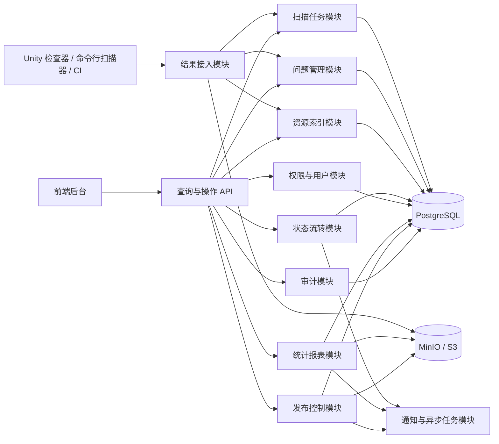
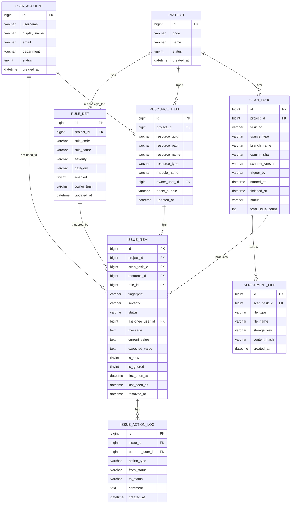

# Content Control Plane

面向游戏项目的内容控制平台，覆盖资源质量门禁、错误资源展示、资源更新控制和发布运维支撑。

## 文档入口

- 文档总览：[docs/README.md](docs/README.md)
- 项目背景：[docs/project_context.md](docs/project_context.md)
- 产品意图：[docs/product_intent.md](docs/product_intent.md)
- 路线图：[docs/roadmap.md](docs/roadmap.md)
- 工作项池：[docs/backlog.md](docs/backlog.md)
- 系统设计入口：[docs/sdd/README.md](docs/sdd/README.md)
- 架构决策入口：[docs/adr/README.md](docs/adr/README.md)
- 测试策略：[docs/testing_strategy.md](docs/testing_strategy.md)
- Runbook 入口：[docs/runbook/README.md](docs/runbook/README.md)
- 当前待你决策：[docs/owner_decisions/current.md](docs/owner_decisions/current.md)
- 变更历史：[CHANGELOG.md](CHANGELOG.md)

## 当前开发流程

当前仓库采用“文档先行 + 决策集中上提 + 小闭环实现”的推进方式：

1. 先固定 `project_context` 和 `product_intent`
2. 再用 `roadmap`、`backlog` 和 `owner_decisions` 固定推进顺序与待拍板事项
3. 再进入 `SDD`、`Data Model`、`API` 和 `ADR`
4. 最后按小闭环实现、测试和运行

当前默认推荐的第一实现闭环是：

- 导入扫描结果
- 查询扫描任务
- 查询问题列表
- 查看问题详情
- 补充问题状态流转

当前开放决策见：[docs/owner_decisions/current.md](docs/owner_decisions/current.md)

## 项目定位

这个项目不是单纯的“错误资源展示页”，而是一个内容控制面：

- 接收 Unity 工具、命令行扫描器或 CI 产生的检查结果
- 展示和跟踪错误资源问题
- 管理资源版本、更新策略、发布审批和回滚记录
- 提供统计、审计、通知和定时任务能力

这个方向比单独做一个 viewer 更完整，也更适合作为 Go 后端项目样本。

## 设计结论

- 架构优先选择模块化单体，不做第一版微服务
- 检查逻辑保留在 Unity 工具、命令行或 CI 中运行
- 后台负责结果接入、查询展示、状态流转、发布控制和运维支撑
- 第一版先做控制面，不急着做资源分发面、CDN 或补丁下发链路

## 第一版范围

### 1. 质量门禁

- 扫描结果导入
- 错误资源展示
- 问题跟踪
- 责任人分配
- 忽略、关闭、验证
- 趋势统计和报表

### 2. 资源发布控制

- 资源版本登记
- 环境提升，例如 `dev -> staging -> prod`
- 发布审批
- 灰度策略记录
- 回滚记录

### 3. 运维支撑

- 用户和角色
- 操作审计
- 通知
- 定时任务
- 报告和附件存储

## 非目标

- 第一版不拆微服务
- 第一版不引入消息队列作为必需组件
- 第一版不引入 Elasticsearch
- 第一版不自建内容分发网络
- 第一版不把扫描器逻辑迁进后台服务

## 技术选型

推荐技术栈：

- `Go`
- `chi`
- `pgx + sqlc`
- `PostgreSQL`
- `goose`
- `MinIO / S3`
- 轻量 worker 或独立 `worker` 进程

选择原因：

- 这是内部工具型系统，核心问题是数据一致性、筛选查询和状态流转，不是超高并发交易
- Go 能作为后端求职样本补足技术栈，同时不会像 Java 那样引入更重的框架成本
- `chi` 足够轻，适合清晰的 REST API
- `pgx + sqlc` 比 ORM 更适合这种规则查询、列表筛选、统计报表场景
- `PostgreSQL` 适合结构化问题数据、聚合统计和后续演进
- 报告、截图、原始扫描产物适合放对象存储，不适合塞进数据库

## 平台架构



## 模块划分

### 结果接入模块

- 接收扫描结果 JSON、日志、截图和报告附件
- 做幂等校验，避免重复导入
- 建立 `scan_task` 与问题明细的关联

### 扫描任务模块

- 记录一次扫描的来源、分支、提交号、扫描器版本和耗时
- 标记扫描状态、问题总数和报告产物

### 问题管理模块

- 存储问题明细
- 支持按项目、规则、资源、负责人、状态筛选
- 支持批量分配、忽略、关闭和验证

### 资源索引模块

- 管理资源路径、GUID、类型、所属模块和责任人
- 作为问题聚合和负责人归属的基础

### 状态流转模块

- 处理 `NEW / ASSIGNED / FIXING / RESOLVED / VERIFIED / IGNORED`
- 记录每次状态变更和备注

### 发布控制模块

- 管理资源版本、环境提升、审批、灰度和回滚元数据
- 提供“哪些资源在什么时候由谁发布到什么环境”的控制记录

### 统计报表模块

- 输出按项目、分支、规则、负责人、时间维度的统计
- 支持日报、周报、趋势图和问题排行

### 权限与用户模块

- 管理用户、角色、项目权限
- 控制哪些人能查看、审批、发布和回滚

### 审计模块

- 记录关键操作
- 为审批、发布和回滚提供审计链路

### 通知与异步任务模块

- 扫描完成通知
- 问题超时提醒
- 定时报表生成
- 发布流程中的异步操作

## 核心数据模型草图

第一版先围绕质量门禁落核心表，发布控制相关表在第二阶段补充。



## 核心状态流转

建议第一版问题状态保持简单：

- `NEW`
- `ASSIGNED`
- `FIXING`
- `RESOLVED`
- `VERIFIED`
- `IGNORED`

说明：

- 扫描导入后默认是 `NEW`
- 指派责任人后进入 `ASSIGNED`
- 开始处理后进入 `FIXING`
- 修复提交后进入 `RESOLVED`
- 下一轮扫描确认消失后进入 `VERIFIED`
- 误报或临时豁免进入 `IGNORED`

## 目录建议

```text
.
  cmd/
    api/
    worker/
  internal/
    api/
    application/
      scantask/
      issue/
      resource/
      workflow/
      release/
      report/
      auth/
    domain/
    infrastructure/
      persistence/
      storage/
      notification/
      scheduler/
  migrations/
  docs/
```

## API 草图

- `POST /api/scan-tasks/import`
- `GET /api/scan-tasks`
- `GET /api/scan-tasks/{id}`
- `GET /api/issues`
- `GET /api/issues/{id}`
- `POST /api/issues/{id}/assign`
- `POST /api/issues/{id}/status`
- `POST /api/issues/{id}/ignore`
- `GET /api/resources/{id}/issues`
- `GET /api/reports/summary`
- `GET /api/reports/trend`
- `POST /api/releases`
- `POST /api/releases/{id}/approve`
- `POST /api/releases/{id}/promote`
- `POST /api/releases/{id}/rollback`

## 开发优先级

建议按下面顺序推进：

1. 先完成 `PROJECT / SCAN_TASK / ISSUE_ITEM / RESOURCE_ITEM` 四张核心表
2. 打通“导入扫描结果 -> 查询扫描任务 -> 查询问题列表 -> 查看问题详情”
3. 补充 `ISSUE_ACTION_LOG` 和问题状态流转
4. 增加统计报表、通知和附件存储
5. 再进入资源发布控制、审批和回滚模块

## 当前结论摘要

- 名字应该体现平台级能力，而不是单页工具
- 最合适的技术架构是 Go 模块化单体，不是微服务
- 第一阶段重点是可见化、可追踪、可控制，不是分发链路
- 真正值钱的点不在语言本身，而在幂等导入、问题指纹、状态流转、趋势统计和审计链路设计


