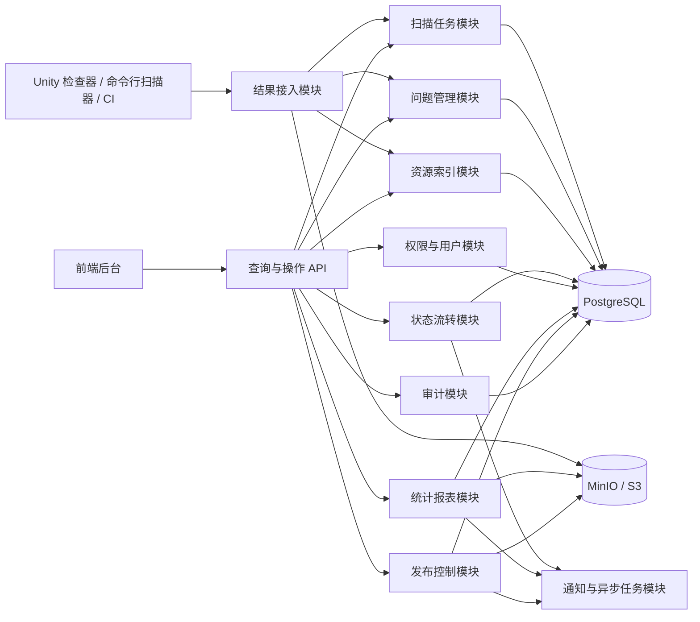
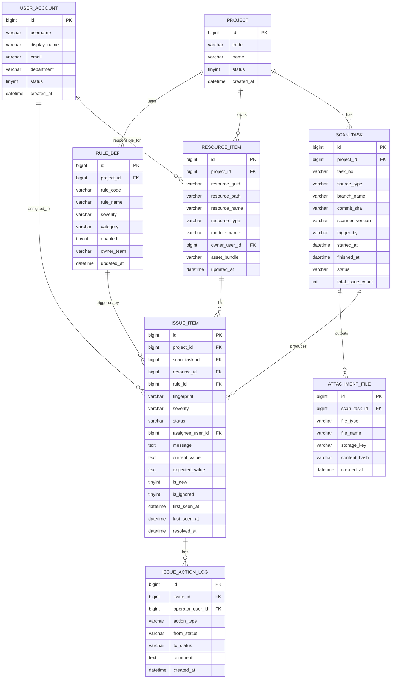

# Architecture

## Platform Architecture

## Module Boundaries

- 结果接入模块：负责接收扫描结果、报告、日志、截图，并做幂等导入
- 扫描任务模块：负责记录扫描来源、分支、提交号、扫描器版本、耗时和状态
- 问题管理模块：负责错误资源问题列表、筛选、分配、忽略、关闭和验证
- 资源索引模块：负责资源路径、GUID、类型、所属模块和责任人映射
- 状态流转模块：负责 `NEW / ASSIGNED / FIXING / RESOLVED / VERIFIED / IGNORED`
- 发布控制模块：负责版本登记、环境提升、审批、灰度和回滚元数据
- 统计报表模块：负责趋势、排行、汇总报表
- 权限与用户模块：负责角色、项目权限和访问控制
- 审计模块：负责关键操作留痕
- 通知与异步任务模块：负责提醒、定时报表、异步发布任务

## Data Model

## Core Flow

1. 扫描器或 CI 生成结果并上传到结果接入模块。
2. 后端创建 `SCAN_TASK`，解析并写入 `ISSUE_ITEM`、`RESOURCE_ITEM`、附件记录。
3. 前端通过查询 API 查看问题列表、详情、趋势和责任归属。
4. 问题在状态流转模块中被分配、修复、验证或忽略。
5. 发布控制模块基于资源和版本信息执行审批、提升和回滚记录。
